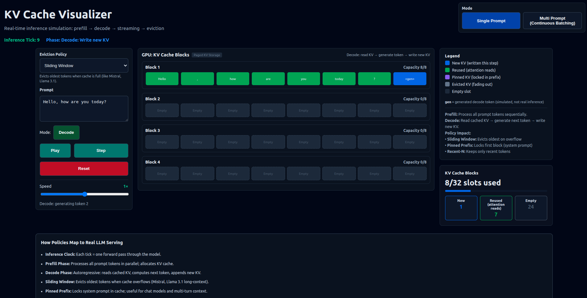
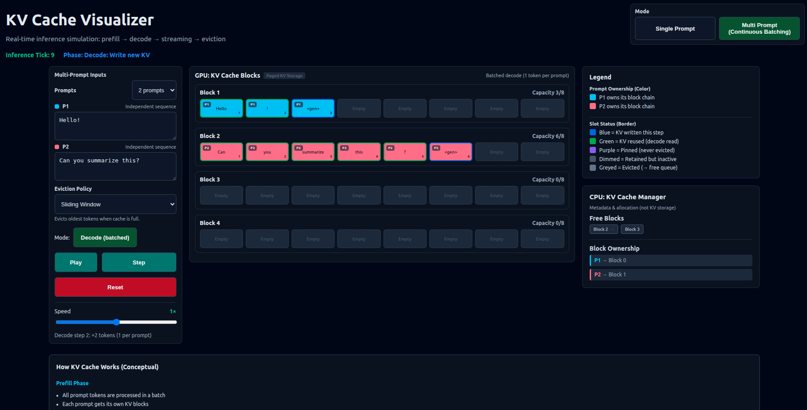

# KV Cache Visualizer

A conceptual, client‑side KV Cache and Paged Attention visualizer for LLM inference. It demonstrates **prefill vs decode**, **paged KV blocks**, and **continuous batching** without running a real model.

> Storage ≠ Attention. Recent‑N limits attention reads, not memory retention.

## Live Demo

- Live Demo: https://kvcachevisualizer.vercel.app/

## Screenshots

- Single Prompt
 

- Multi-Prompt

## Core Concepts

### Prefill vs Decode

- **Prefill** writes KV for the full prompt (batch‑parallel).
- **Decode** reads KV, generates one token, then writes a new KV entry (autoregressive).

### KV Cache

KV Cache stores key/value vectors per token and layer so decode can reuse prior context without recomputing.

### Paged Attention

KV is modeled as **fixed‑size blocks (pages)** and **slots** to show how real systems manage paged KV memory.

### Continuous Batching

Multiple prompts run together; decode adds one token per prompt per step while preserving prompt‑owned block chains.

## Features

### Modes

- **Single Prompt**: one sequence, step‑by‑step prefill → decode.
- **Multi Prompt (Continuous Batching)**: multiple sequences in flight.

### Eviction Policies

- **Sliding Window**
- **Pinned Prefix**
- **Recent‑N Tokens** (attention window only)

## What This Is / What This Is NOT

**This is:**

- A conceptual simulator for KV cache mechanics.
- A visual teaching tool for paged attention and continuous batching.

**This is not:**

- Real model inference or a chatbot.
- A performance benchmark or numeric accuracy test.

## Tech Stack

- Next.js App Router (16)
- React 19 + TypeScript
- Tailwind CSS 4

## Project Structure (High‑Level)

- `/app`: Next.js App Router entrypoints
- `/modes`: stateful mode containers (single vs multi)
- `/core`: pure simulator logic (allocator, stepper, policies)
- `/eviction`: eviction policy plug‑ins
- `/prompts`: tokenization + prompt streams
- `/components`: presentational UI
- `/lib`: shared utilities
- `/docs`: architecture notes

## Local Development

1. Install Node.js 20+.
2. Install dependencies: `npm install`
3. Start dev server: `npm run dev`
4. Optional checks: `npm run lint`, `npm run build`

## Deployment (Vercel)

- Connect the repository to Vercel.
- Use the default Next.js build settings.

## Limitations & Design Choices

- Tokens are labels, not tokenizer outputs.
- No tensor math, attention scores, or model weights.
- Deterministic stepping for easy visual verification.

## Architecture Overview

See [docs/ARCHITECTURE.md](docs/ARCHITECTURE.md).

## Roadmap (Optional)

- Additional eviction policies
- More detailed per‑prompt debug overlays
- Expanded conceptual annotations

## License

License is not specified yet.

## Acknowledgements / References

- vLLM
- Paged Attention literature and blog posts
