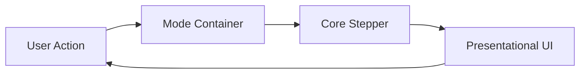

# Architecture Overview

This project is a conceptual KV Cache and Paged Attention visualizer. It is intentionally deterministic and UI-driven so the same inputs always produce the same cache evolution.

## Layers

- **Core simulation (pure logic)**
  - `/core` contains step functions, allocation helpers, and policy visual semantics.
  - No React, no DOM, no side effects.
- **Mode containers (state + orchestration)**
  - `/modes` owns per-mode state and timers.
  - Calls the core stepper and passes results into UI.
- **UI (presentational)**
  - `/components` render blocks, slots, and panels based on props.
  - No allocation or policy decisions are made here.

## Data Flow per Tick

1. **User action** → Play / Step / Reset
2. **Mode container** dispatches to core `step()`
3. **Core** updates KV entries + phase + counters (pure, immutable)
4. **UI** re-renders from the new state

## Conceptual Mapping to LLM Serving

- **Prefill** is batch-parallel: KV is written for the entire prompt.
- **Decode** is autoregressive: read KV, generate one token, write new KV.
- **Paged Attention** is represented by fixed-size blocks and per-block slot occupancy.
- **CPU vs GPU**: CPU is depicted as metadata/control; GPU holds KV blocks.

## What Is Simplified

- No real tensor math, logits, or attention scores.
- No real model weights or latency modeling.
- Tokens are simulated labels, not tokenizer outputs.

## Mermaid (Optional)

